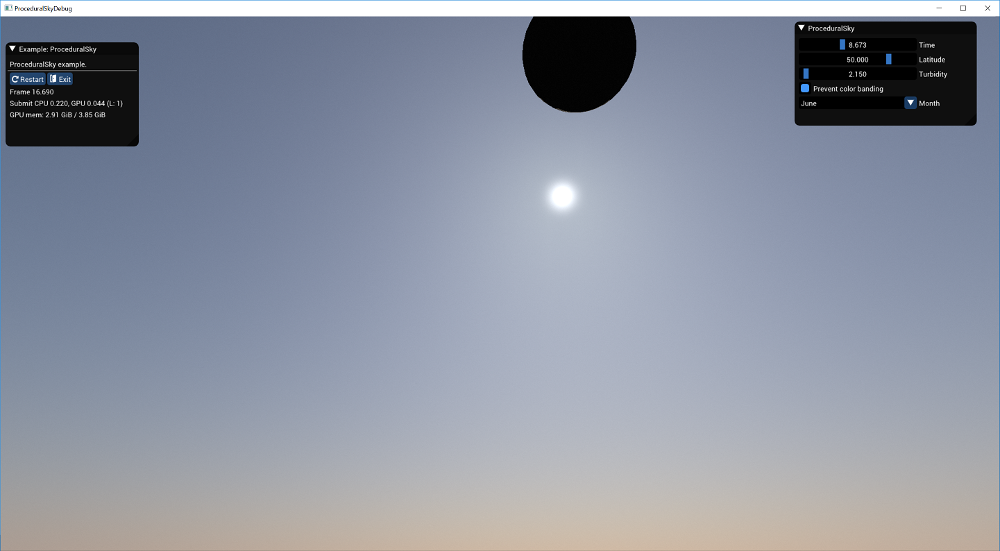
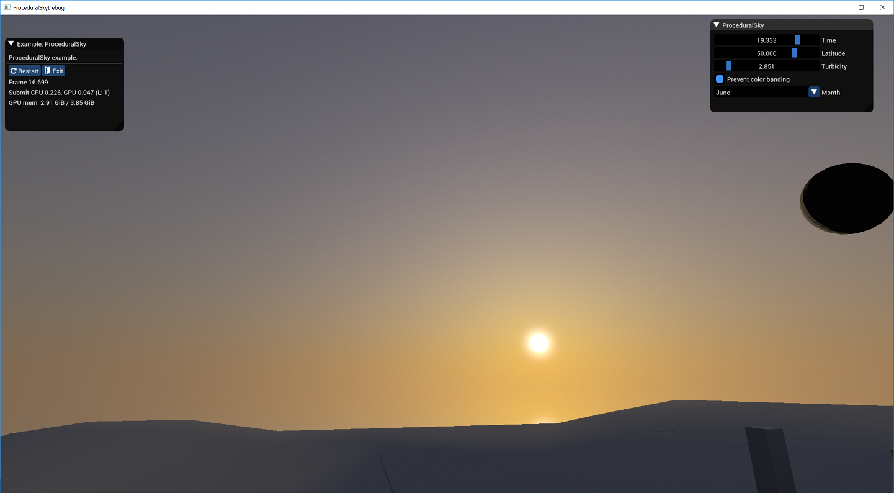

# [ProceduralSky](https://github.com/podgorskiy/ProceduralSky)

Example of implementation of dynamic procedural sky.

Based on:

 - R. Perez, R. Seals, and J. Michalsky."An All-Weather Model for Sky Luminance Distribution". Solar Energy, Volume 50, Number 3 (March 1993), pp. 235–245.
 - A. J. Preetham, Peter Shirley, and Brian Smits. "A Practical Analytic Model for Daylight", Proceedings of the 26th Annual Conference on Computer Graphics and Interactive Techniques, 1999, pp. 91–100.
  - Game Engine Gems, Volume One, chapter 15, 16

# How to build:

 1. After cloning the repository do: 
```
git submodule update --init
```
 2. Run `generate.sh <action>` (`generate.bat <action>` on windows if no mingw). Where `action` one of: gmake/vs2013/vs2015/xcode4, for more options read documentation for https://github.com/bkaradzic/GENie.
 3. Build project from the generated projects files in `projects` folder.
 
 There is no need to run `build_data.sh` since there is already prebuld runtime data. If you want to build it, you will have to build bgfx's tools first.

# Screenshots:




